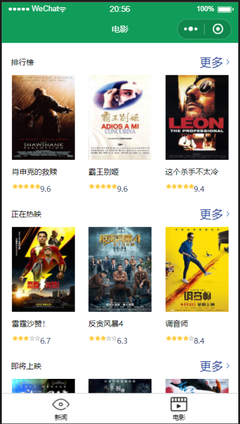

# 电影排名

##### 这是一个电影排名的小项目 采用豆瓣的数据接口和微信小程序的API编写(项目分为两个模块:新闻和电影)

### 新闻列表

    
    点击进入  可以点击收藏
### 电影页面
    
    电影板块分为排行榜,正在热映和即将上映三个分类
    点击更多进入各自的列表,点击电影(图片 title star)进入各自的详情页

    排行榜
    

    电影详情页
    

### 项目环境
    使用的是豆瓣的api,会产生跨域问题,配置了node环境,解决跨域

    下载下来之后,进入server文件夹,打开命令行 npm install 下载暗转依赖,然后就可以观看了